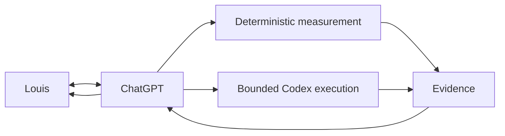
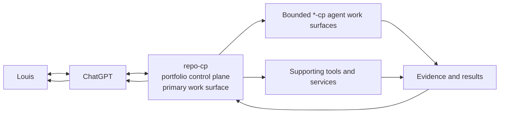
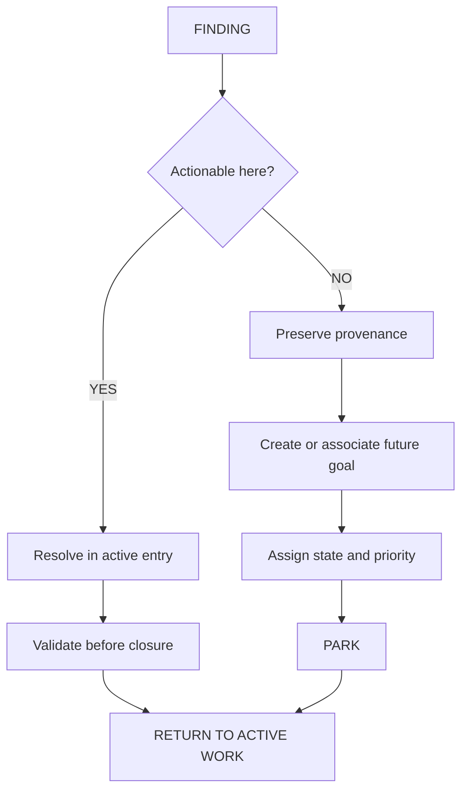
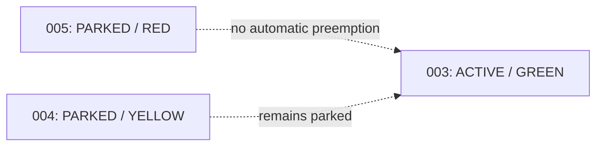
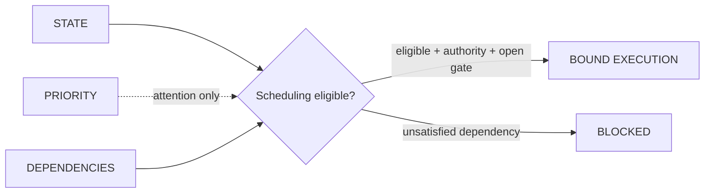
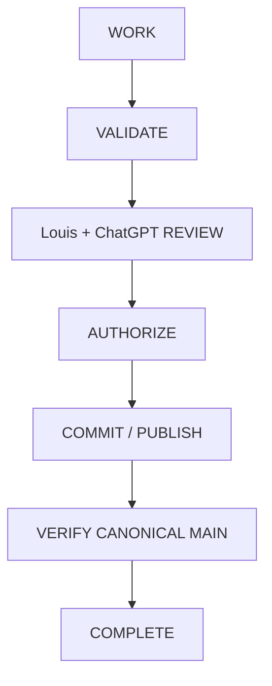
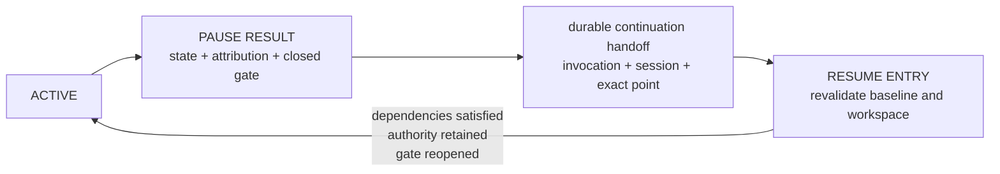

# louis-workflow

Contract: `HELIX_LOUIS_WORKFLOW_V1`

Custodian: repo-cp at Louis's direction

Scope: human/agent operating cadence, authority boundaries, work topology and
handoff behavior

`louis-workflow` is an operational contract, not a personality description. It
describes the working loop around which repo-cp is engineered. The
machine-readable current topology is
[`registries/work-topology.json`](../registries/work-topology.json); the work
entry and result schemas carry bounded task state and evidence.

## Cadence

Louis works interactively and iteratively:

```text
observe
  -> reason and review with ChatGPT
  -> identify the next bounded question or action
  -> use deterministic tooling or bounded Codex execution
  -> inspect evidence
  -> decide
  -> continue
```

Optimize for cheap checkpoints, excellent provenance and fast resumption, not
maximum unattended runtime. ChatGPT should make explicit recommendations and
prepare bounded handoffs; it should not turn an actionable request into passive
project-management prose or require Louis to relay large unstructured messages.



## Roles and authority

- Louis retains decision, authorization, approval and exception authority.
- ChatGPT provides architecture, synthesis, review, explicit recommendations
  and bounded handoffs.
- Codex provides repository-local inspection, implementation, testing and
  evidence within granted authority.
- Deterministic tools establish facts whenever model reasoning is unnecessary.

A request is not authority. Priority is not authority. Observation is not
mutation authority. A topology record communicates state and attention; it
cannot grant execution, mutation, publication, peer or live-system authority.

Some entries are fundamentally human-led reviews. Work Entry 003 cleanup is the
reference case: Codex may prepare evidence and execute a later bounded action,
but Louis + ChatGPT own classification, judgment and the decision. Guardrails
constrain action without suppressing useful inspection, reasoning or proposals.

## Control plane and work surfaces

repo-cp is the portfolio control plane and the primary Louis + ChatGPT work
surface. It owns portfolio reasoning and topology, work-entry creation and
lifecycle, standards and contracts, finding and future-work disposition, state
and priority, evidence review, cross-repository coordination,
authorization/decision provenance, acceptance and canonical closure.

Individual `*-cp` repositories are bounded agent work surfaces. Agents operate
there only under explicit authority and contracts carried by a repo-cp work
entry, then return evidence and results to repo-cp for Louis + ChatGPT review.
Repository access, a request, a finding or a priority does not substitute for
that authority.

`helix-offload`, `helix-repo-manager-bot`, `ws-code-agent`, and `ws-doc-writer`
are supporting tools or services available to the control plane. They must not
independently become competing portfolio control planes.



## Intelligence efficiency

Do not buy intelligence to perform measurement. Prefer Git, content hashes,
parsers, schemas, filesystem metadata, test runners and other deterministic
mechanisms for factual collection. Give models compact structured evidence and
reserve model reasoning for interpretation, relationships, ambiguity,
architecture and judgment.

This rule motivates parked Work Entry 005. It does not authorize beginning it.

## Resolvable UNKNOWNs

When deterministic evidence reaches a boundary and the result is `UNKNOWN`, ask
whether Louis may possess relevant provenance, intent, history or context. If he
may, surface the exact UNKNOWN to him before closing that finding. Do not guess,
search increasingly remote sources, or automatically label it blocking. Louis
may supply context, decline, or decide that resolution is unnecessary. The
question is a cheap human checkpoint, not mutation authority.

## Finding disposition

Every finding discovered during an active entry is tested against that entry's
objective and authority. An actionable in-scope finding remains in the active
entry and must be resolved and validated before closure. A valuable finding that
is not actionable within the current objective or authority must not silently
expand scope. Preserve its provenance, create or associate a separately
identified future work entry, assign state and priority, park it, and immediately
return to the active work. Creating or prioritizing future work never authorizes
its execution.

Louis + ChatGPT may instead preserve closely related findings as one named
future-work candidate group when creating separate work entries would be
premature. The grouped findings retain provenance and remain non-executing; they
do not receive work-entry state, priority or scheduling eligibility until a later
review explicitly promotes them.



Work Entry 003 exercised both branches. State-versus-priority and disposition
behavior are actionable 003 findings. Publication/evidence architecture became
004 (`PARKED + YELLOW`), and deterministic evidence/review tooling became 005
(`PARKED + RED`). Neither parked entry is authorized to execute.

Discovery closure is bounded by the current work entry. A discovery or repair
pass is complete only when the stated scope and checks yield no additional
actionable in-scope findings. Record the checks performed, remaining unknowns
and open findings. Recheck materially changed evidence after a repair; do not
repeat unchanged checks merely to manufacture confidence. A finding closes only
with its acceptance evidence or an explicit, provenance-preserving handoff.
Unknown or unexamined areas remain `UNKNOWN`, not `PASS`.

## State and priority

State and priority are independent dimensions:

- **State** records lifecycle or execution position. The current registry uses
  `PARKED`, `ACTIVE` and `COMPLETE`.
- **Priority** records attention or urgency: `GREEN`, `YELLOW` or `RED`.

Machine-readable values are words; color and icon treatments are presentation
only. Priority does not grant authority, mutation permission or execution
status, and it does not automatically preempt active work.



Completed entries retain their recorded priority. Completion does not rewrite
history merely to make the topology visually uniform.

## Scheduling eligibility

State, priority and dependencies are independent scheduling inputs. Priority
communicates attention only: it never satisfies a dependency, changes state,
opens a mutation gate, grants authority or triggers automatic preemption. An
entry is eligible to execute only when its state permits execution and every
blocking dependency is satisfied.



Work Entry 006 demonstrated this rule. Its `RED` priority did not preempt 003:
while louis-workflow and current topology remained unpublished 003 work, 006
was `BLOCKED + RED`. Canonical publication of 003 satisfied that dependency, so
006 returned to `PARKED + RED`. It remains ineligible and unstarted until the
governing workflow and authority advance it. This finding does not authorize
006 or change the parked state of 004 or 005.

## Review, authorization and closure

Implementation or validation alone does not make a work entry complete. Preserve
the full closure lifecycle:



Review may send a bounded action back to Codex and repeat the loop. A successor
must not inherit unpublished predecessor findings as canonical state. Report
delivery stages separately, and call an entry `COMPLETE` only after its required
review, authority, publication and canonical verification conditions are met.

## Pause and resume

A pause is a durable handoff, not an implicit cancellation or a new work entry.
Its result records the execution workspace state and attribution, the mutation
gate at handoff, every in-flight invocation's identity, disposition and
attribution, the session binding and whether it was retained or released, the
exact continuation point, and the checks required before resumption. A paused
entry is not scheduling-eligible and its mutation gate is closed.



Resume uses the same work-entry identifier and preserved provenance. Before the
gate may reopen, revalidate the canonical baseline, workspace identity and dirty
state, attribution, dependencies, retained authority and listed continuation
requirements. Record the resumed session binding; never silently treat an
interrupted invocation as completed or attribute its effects to a new task.

## Parking and resumption

A parked entry retains its identifier, purpose, provenance, state and priority.
Resumption requires the governing workflow and authority to advance it; changing
priority alone is insufficient. On resumption, prepare a bounded work entry from
the current canonical baseline rather than treating the parked note as mutation
authority or as proof that predecessor findings were published.

## Provenance

### Observation

Work Entries 002 and 003 repeatedly used short inspect/reason/act/review loops,
deterministic repository evidence, explicit authority boundaries and isolated
execution. During 003, useful out-of-scope discoveries were preserved as 004
and 005 while the active reconciliation continued.

### Interpretation

Those successful observed behaviors form a reusable operating contract: cheap
checkpoints, deterministic measurement, independent state and priority, explicit
finding disposition, one portfolio control plane with bounded work surfaces, and
human-controlled closure.

### Limit

This is an empirically derived repository workflow, not a claim about general
intelligence and not an abstract project-management methodology. Future evidence
may justify a reviewed revision; it does not silently change this contract.
